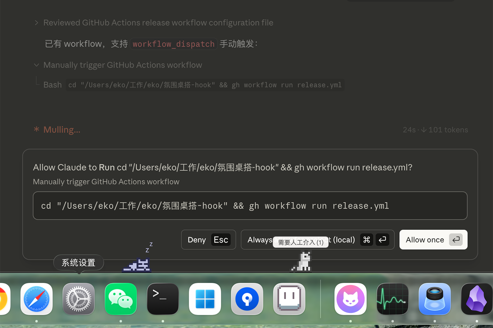
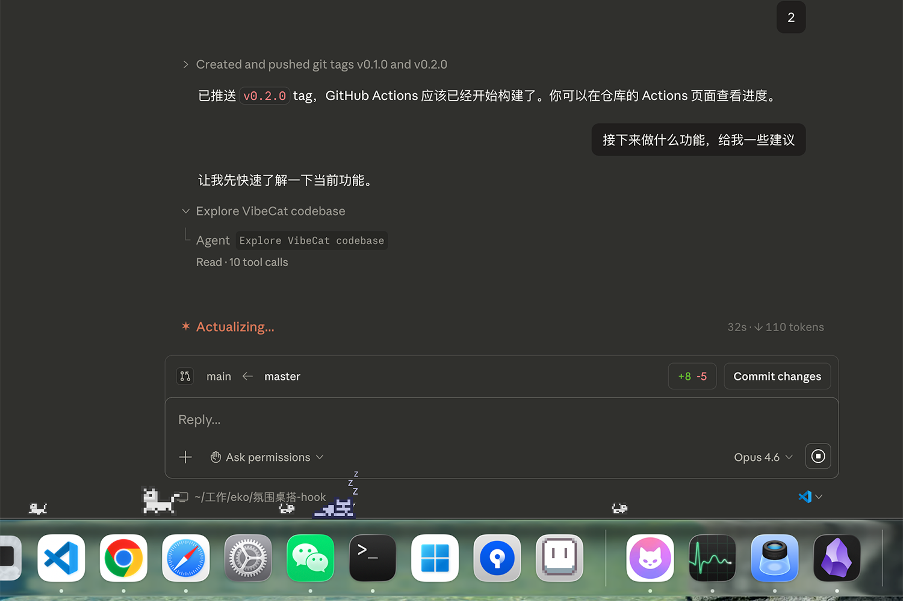

# Vibe Cat

[English](#english) | [中文](#中文)

<p align="center">
  
  
</p>

---

<a name="english"></a>

## A Desktop Pet That Watches Your AI Coding Agents

Vibe Cat is a macOS desktop pet that sits on your Dock and reacts to [Claude Code](https://docs.anthropic.com/en/docs/claude-code) and [Codex](https://github.com/openai/codex) activity in real time. It walks, runs, sleeps, and plays based on what your AI agent is doing — and pops up a bubble when it needs your attention.

### Features

- **Pixel cat on your Dock** — a 32px sprite with 10 animation states (walk, run, sit, sleep, play, pounce, stretch...) scaled 3x, sitting right above your Dock
- **Real-time AI agent tracking** — monitors Claude Code and Codex, reflects session state as cat behavior
- **Permission request alerts** — when Claude Code needs approval, the cat shows a persistent bubble with pending count until all requests are resolved
- **Subagent tracking** — spawns mini cats for each Claude Code subagent, they run back and disappear when the subagent finishes
- **Dual agent support** — track Claude Code (cc) and Codex (cx) simultaneously with independent main cats, togglable from the tray menu
- **Menu bar status** — tray icon animates based on combined agent state
- **Drag interaction** — drag the cat around with your mouse
- **Multi-display Dock support** — the cat anchors to the screen that currently contains the Dock (not always the primary display)
- **Auto-hide Dock support** — the cat re-snaps to the Dock edge when the Dock shows/hides
- **Side Dock fallback (floor mode)** — when Dock is on the left/right, the cat still walks along the bottom edge of the visible frame; it does not stick to the vertical side

### Install

```bash
git clone https://github.com/gogoswift/vibe-cat.git
cd vibe-cat
./build-app.sh
# Built: target/release/bundle/osx/VibeCat.app
```

### Development (Auto Restart)

```bash
# one-time setup
cargo install cargo-watch

# default: watch src/Cargo.toml and run `cargo run -- cat`
./dev.sh
```

```bash
# pass custom cargo-watch args (example: run GUI instead of cat window)
./dev.sh -x 'run -- gui'
```

### Cat Behavior

| AI Agent State | Cat Animation |
|---|---|
| Active (tool use, API calls, subagent work) | Walk, Run |
| Idle (stopped, waiting, permission needed) | Sit, Play |
| Offline (session ended) | Sleep |
| Permission requested | Bubble: "needs human intervention (N)" |
| Subagent spawned | Mini cat appears and follows the main cat |
| Subagent finished | Mini cat runs back and disappears |

### Requirements

- macOS
- Rust 1.70+
- Claude Code and/or Codex

---

<a name="中文"></a>

## 一只盯着你 AI 编程助手的桌面宠物

Vibe Cat 是一个 macOS 桌面宠物，趴在你的 Dock 上，实时反映 [Claude Code](https://docs.anthropic.com/en/docs/claude-code) 和 [Codex](https://github.com/openai/codex) 的工作状态。它会根据 AI 助手的行为走路、奔跑、睡觉、玩耍——需要你介入时还会弹出气泡提醒。

### 功能特性

- **像素猫趴在 Dock 上** — 32px 精灵图，10 种动画状态（走路、奔跑、坐下、睡觉、玩耍、扑击、伸懒腰……），3 倍放大，紧贴 Dock 栏上方
- **实时追踪 AI 助手** — 监控 Claude Code 和 Codex，将会话状态映射为猫的行为
- **权限请求提醒** — Claude Code 需要确认时，猫会显示持续气泡并标注待处理数量，直到全部处理完毕才消失
- **子代理追踪** — Claude Code 产生子代理时会生成迷你猫，子代理结束后迷你猫跑回主猫并消失
- **双助手支持** — 同时追踪 Claude Code (cc) 和 Codex (cx)，各自独立的主猫，可在托盘菜单中开关
- **状态栏动画** — 托盘图标根据所有助手的综合状态变化
- **拖拽交互** — 可以用鼠标拖拽猫
- **多屏 Dock 支持** — 猫会锚定到 Dock 所在屏幕，而不是固定主屏
- **自动隐藏 Dock** — Dock 显示/隐藏会触发重新贴边，猫会跟随重新贴近 Dock 边缘
- **左/右 Dock 退化（floor mode）** — Dock 位于左/右侧时猫仍沿可见区域底边活动（不做竖向贴边），并且不会进入 Dock 占用区域

### 安装

```bash
git clone https://github.com/gogoswift/vibe-cat.git
cd vibe-cat
./build-app.sh
# Built: target/release/bundle/osx/VibeCat.app
```

### 开发模式（自动重启）

```bash
# 首次使用先安装 cargo-watch
cargo install cargo-watch

# 默认监听 src/Cargo.toml，并执行 `cargo run -- cat`
./dev.sh
```

```bash
# 传递自定义 cargo-watch 参数（示例：启动 GUI）
./dev.sh -x 'run -- gui'
```

### 猫的行为

| AI 助手状态 | 猫的动画 |
|---|---|
| 活跃（工具调用、API 请求、子代理工作） | 走路、奔跑 |
| 空闲（已停止、等待中、需要权限确认） | 坐下、玩耍 |
| 离线（会话结束） | 睡觉 |
| 权限请求待处理 | 气泡："需要人工介入 (N)" |
| 子代理启动 | 迷你猫出现并跟随主猫 |
| 子代理结束 | 迷你猫跑回主猫并消失 |

### 系统要求

- macOS
- Rust 1.70+
- Claude Code 和/或 Codex

---

## License

MIT
